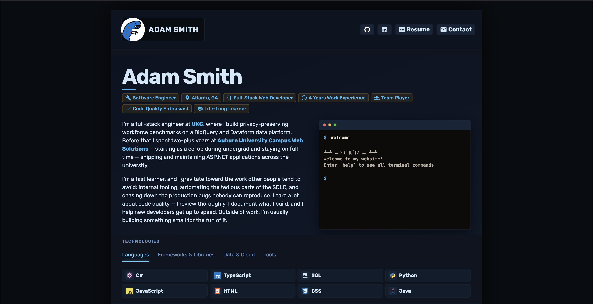

# 🚀 cadamsmith.dev

Personal portfolio site built with **Astro** + **Svelte 5**, deployed on **Cloudflare Pages**.



## stack

- [astro](https://astro.build/) — static site generation, file-based routing, content collections
- [svelte 5](https://svelte.dev/) — interactive islands (skills widget, timeline, projects, music player, map)
- [leaflet](https://leafletjs.com/) — interactive location map
- [cloudflare pages](https://pages.cloudflare.com/) — hosting and deployment
- [typescript](https://www.typescriptlang.org/) — throughout

## architecture

All pages are **prerendered at build time** (static output). Interactive components are mounted as Svelte islands with `client:visible`.

Site content is driven by **Astro content collections** in `src/content/`:

| Collection  | Description                                                   |
| ----------- | ------------------------------------------------------------- |
| `skills/`   | Tech skills shown in the skills widget                        |
| `timeline/` | Work and education history with location + coordinates        |
| `projects/` | Projects shown in the projects widget                         |
| `songs/`    | Music player playlist + `/songs` browse page (YouTube embeds) |
| `blurbs/`   | Hero and contact section copy                                 |
| `heroTags/` | Info tags shown in the hero section                           |

## local setup

```bash
git clone https://github.com/cadamsmith/cadamsmith.dev.git
cd cadamsmith.dev
npm install
npm run dev
```

## commands

```bash
npm run dev        # Start development server
npm run build      # Build for production (static output to dist/)
npm run preview    # Preview production build
npm run test       # Run Vitest unit tests
npm run lint       # Run Prettier + ESLint checks
npm run format     # Auto-format with Prettier
npm run check      # Astro type checking
npm run resume     # Regenerate resume.pdf from content (local tool; needs Gleam + Typst)
```

## resume generator

The served resume (`public/resume.pdf`) is generated from the site's own content,
so it stays in sync with the rest of the site. A small [Gleam](https://gleam.run)
CLI in `tools/resume/` parses the content collections (`timeline/`, `skills/`,
`projects/`) plus `tools/resume/profile.yaml`, then renders a
[Typst](https://typst.app) template to PDF.

```bash
npm run resume   # writes public/resume.pdf — review the diff before committing
```

This is a **local, on-demand tool** — it needs `gleam` (+ Erlang) and `typst`
installed (`brew install gleam typst`) and is intentionally **not** part of
`npm run build` or CI. See [`tools/resume/README.md`](tools/resume/README.md) for details.
